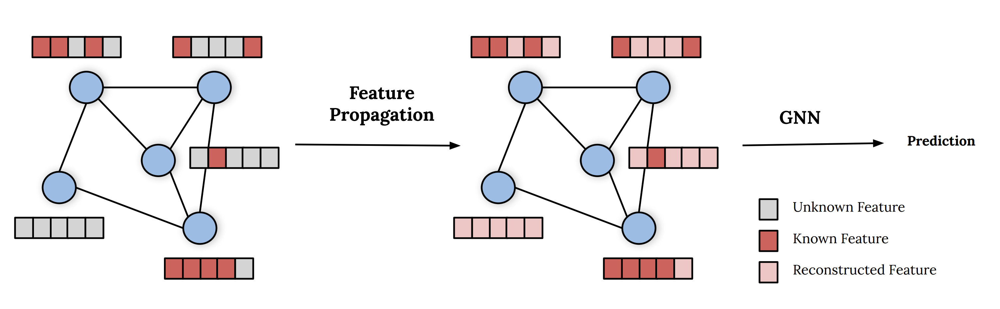

# Feature Propagation for Learning on Graphs with Missing Node Features [[Paper](https://arxiv.org/abs/2111.12128), [Blog Post](https://towardsdatascience.com/learning-on-graphs-with-missing-features-dd34be61b06), [Presentation](https://www.youtube.com/watch?v=xe5A-xQTBdM), [Slides](https://emanuelerossi.co.uk/assets/pdf/feature_propagation.pdf)]

[](https://opensource.twitter.dev/status/#static)


## Introduction

While Graph Neural Networks (GNNs) have recently become the de facto standard for modeling relational data, they impose a strong assumption on the availability of the node or edge features of the graph. In many real-world applications, however, features are only partially available; for example, in social networks, age and gender are available only for a small subset of users. 

This repo contains the code for Feature Propagation, a general approach for handling missing features in graph machine learning applications that is based on minimization of the Dirichlet energy and leads to a diffusion-type differential equation on the graph. The discretization of this equation produces a simple, fast and scalable algorithm. 

We experimentally show that the proposed approach outperforms previous methods on seven common node-classification benchmarks and can withstand surprisingly high rates of missing features: on average we observe only around 4% relative accuracy drop when 99% of the features are missing. Moreover, it takes only 10 seconds to run on a graph with ∼2.5M nodes and ∼123M edges on a single GPU.


## Running the Code

### Dependencies
Our implementation works with python >= 3.9 and has the following dependencies:

```{bash}
torch==1.10.2
pyg==2.0.3
ogb==1.3.1
```

which can be installed as follows using conda:

```{bash}
conda create -n feature_propagation python=3.9
conda activate feature_propagation
conda install pytorch=1.10.2 -c pytorch
conda install pyg=2.0.3 -c pyg -c conda-forge
pip install ogb==1.3.2
```

where *cudatoolkit=10.2* would need to be added to the second line if the GPU version of PyTorch is desired (also changing *10.2* to the cuda version of your GPU). Refer to the [PyTorch installation page](https://pytorch.org/) for more details.


### Feature Propagation
Feature Propagation can be run with the following command:
```{bash}
python src/run.py --dataset_name Cora --missing_rate 0.99
```
where *dataset_name* can be any of "Cora", "CiteSeer", "PubMed", "OGBN-Arxiv", "OGBN-Products" and missing rate is the rate of missing features.

### Baselines
GCNMF and PaGNN can be run as follows:
```{bash}
python src/run.py --model gcnmf --dataset_name Cora --missing_rate 0.99
python src/run.py --model pagnn --dataset_name Cora --missing_rate 0.99
python src/run.py --model lp --dataset_name Cora --lp_alpha 0.9
```

The other baselines can be run by specifying the *filling_method* argument:
```{bash}
python src/run.py --filling_method zero --dataset_name Cora --missing_rate 0.99
python src/run.py --filling_method random --dataset_name Cora --missing_rate 0.99
python src/run.py --filling_method mean --dataset_name Cora --missing_rate 0.99
python src/run.py --filling_method neighborhood_mean --dataset_name Cora --missing_rate 0.99
```

### Homophily Experiment
The results on the synthetic data with variying degree of homophily can be run as follows:
```{bash}
python src/run.py --model sage --dataset_name MixHopSynthetic --missing_rate 0.99 --homophily 0.1
```
where *homophily* can be any one of [0.0, 0.1 ..., 0.9].

### Additional Flags

```{txt}
Main arguments:
  --dataset_name               Name of dataset
  --filling_method             Method to solve the missing feature problem
  --model                      Type of model to make a prediction on the downstream task
  --missing_rate               Rate of node features missing
  --num_iterations             Number of diffusion iterations for feature reconstruction
```

## Cite us

```bibtex
@article{rossi2021fp,
    title={On the Unreasonable Effectiveness of Feature propagation in Learning on Graphs with Missing Node Features},
    author={Emanuele Rossi and Henry Kenlay and Maria I. Gorinova and Ben Chamberlain and Xiaowen Dong and Michael M. Bronstein},
    year={2021},
    journal={ArXiv},
    arXiv={2111.12128},
    abbr={arXiv},
} 
```
